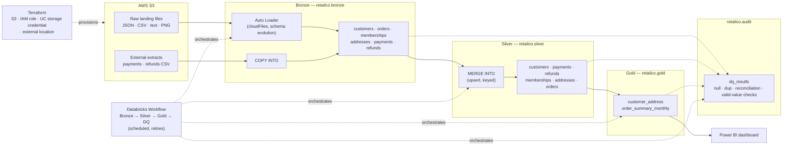

# AWS Databricks Medallion Lakehouse

An end-to-end data lakehouse for a fictional mid-size e-commerce retailer, **RetailCo**, built on **Databricks**, **Apache Spark**, **Delta Lake**, and **AWS S3**. It ingests raw operational exports (customers, orders, memberships, addresses, payments, refunds), cleans and conforms them through a **Bronze → Silver → Gold** medallion architecture, checks their quality at every hop, and serves the result to a Power BI dashboard — all orchestrated as code with Databricks Asset Bundles, Terraform, and CI.

This started as a fork of [Amanullah08072/databricks-medallion-lakehouse-pipeline](https://github.com/Amanullah08072/databricks-medallion-lakehouse-pipeline), a tutorial-style walkthrough of the medallion pattern. I kept the original transformation logic and layer structure, then rebuilt everything around it into something closer to how I'd actually run this in production. See [Acknowledgements](#acknowledgements) and [What I changed](#what-i-changed) below.

---

## Table of contents

- [Business problem](#business-problem)
- [Architecture](#architecture)
- [Tech stack](#tech-stack)
- [Repository layout](#repository-layout)
- [Setup](#setup)
- [How to run](#how-to-run)
- [Data dictionary](#data-dictionary)
- [Data quality](#data-quality)
- [Testing](#testing)
- [What I changed](#what-i-changed)
- [Future improvements](#future-improvements)
- [Acknowledgements](#acknowledgements)
- [License](#license)

---

## Business problem

RetailCo's operational data lands in S3 as disconnected exports: customer profiles as JSON, orders as newline-delimited (and slightly malformed) JSON, addresses as tab-separated CSV, membership cards as PNG images, and payments/refunds as CSV extracts from a separate billing system. No table joins customer identity to their orders, spend, or membership status, and there's no reliable way to answer basic questions like "what did we sell last month, to whom, and did the numbers reconcile end to end?"

This project turns that raw, multi-format data into a governed, queryable lakehouse: a single `customer_address` view of who the customer is, a `order_summary_monthly` rollup of what they bought, and an audit trail proving the numbers can be trusted — re-runnable on a schedule without duplicating data.

## Architecture



- **Bronze** ingests raw files as-is (with source lineage and a rescued-data column for schema drift) into managed Delta tables — incrementally, via Auto Loader for the file-based landing sources and `COPY INTO` for the external CSV extracts, so re-running a job never reprocesses or duplicates a file.
- **Silver** cleans, types, deduplicates, and flattens each source, upserting with `MERGE INTO` keyed on each table's natural key.
- **Gold** joins and aggregates Silver into business-facing tables that BI tools query directly.
- **Data quality** checks run against every layer and log a pass/fail row per check to an audit table, so a broken run is visible instead of silently propagating bad data downstream.
- **Orchestration, infra, and CI** are all code: a Databricks Asset Bundle defines the scheduled job/DAG, Terraform provisions the S3 bucket and Unity Catalog access, and GitHub Actions lints, tests, and validates the bundle on every PR.

## Tech stack

| Layer | Tools |
|---|---|
| Storage | AWS S3, Delta Lake |
| Compute / warehouse | Databricks (Unity Catalog, Auto Loader, Delta Live clusters), Apache Spark SQL, PySpark |
| Ingestion | Auto Loader (`cloudFiles`), `COPY INTO` |
| Transformation | PySpark (`src/`), `MERGE INTO` |
| Orchestration | Databricks Workflows via Databricks Asset Bundles (`databricks.yml`) |
| Data quality | Custom PySpark checks written to `retailco.audit.dq_results` |
| Infrastructure as code | Terraform (S3, IAM, Unity Catalog storage credential & external location) |
| CI/CD | GitHub Actions (`ruff`, `pytest`, `databricks bundle validate`) |
| Testing | `pytest` with a local `SparkSession` |
| BI | Power BI (see [docs/dashboard.md](docs/dashboard.md)) |

## Repository layout

```
.
├── notebooks/
│   ├── setup/          # catalog/schema bootstrap, S3 connection check, dev-only seed data
│   ├── bronze/         # thin runners: Auto Loader / COPY INTO into Bronze
│   ├── silver/         # thin runners: MERGE INTO into Silver
│   ├── gold/           # thin runners: Gold joins/aggregates
│   ├── data_quality/   # thin runner: DQ checks -> audit table
│   └── learning/       # original Spark-concept notebooks, kept for reference
├── src/retailco_lakehouse/  # all reusable, unit-tested transformation & pipeline logic
├── tests/              # pytest suite (local SparkSession)
├── infra/              # Terraform for S3 / IAM / Unity Catalog
├── docs/               # s3_setup.md, dashboard.md
├── .github/workflows/  # CI
├── databricks.yml      # Databricks Asset Bundle (jobs, schedule, targets)
├── pyproject.toml      # ruff + pytest config
├── requirements.txt
└── LICENSE
```

## Setup

### Prerequisites

- A Databricks workspace on AWS with Unity Catalog enabled
- An AWS account with permission to create an S3 bucket and IAM role
- [Databricks CLI](https://docs.databricks.com/dev-tools/cli/index.html) v0.230+ (`databricks -v`)
- [Terraform](https://developer.hashicorp.com/terraform/install) >= 1.5
- Python 3.10+

### 1. Provision infrastructure

```bash
cd infra
cp terraform.tfvars.example terraform.tfvars   # fill in your bucket name, account id, Databricks account id
terraform init
terraform plan
terraform apply
```

This creates the S3 bucket, the IAM role Databricks assumes, the Unity Catalog storage credential, and the external location. See [docs/s3_setup.md](docs/s3_setup.md) for the manual, click-through version of the same steps (useful if you want to understand what Terraform is doing, or don't want to use Terraform at all).

### 2. Configure the bundle

Edit `databricks.yml` (or pass `-v` overrides) to set:
- your Databricks workspace host
- `bucket_name` — the S3 bucket from step 1 (never hardcoded in source)
- `catalog` — defaults to `retailco`; override per target (e.g. `retailco_dev`)

### 3. Deploy and run

```bash
databricks bundle deploy -t dev
databricks bundle run medallion_pipeline -t dev
```

This deploys the notebooks and the `medallion_pipeline` job (Bronze → Silver → Gold → data quality, scheduled daily, with retries — see [databricks.yml](databricks.yml)) to your workspace.

### 4. Local development

```bash
python -m venv .venv && source .venv/bin/activate   # or .venv\Scripts\activate on Windows
pip install -r requirements.txt
pytest
ruff check .
```

## How to run

- **Full pipeline, scheduled**: the Databricks Workflow deployed by the bundle runs Bronze → Silver → Gold → data quality daily; trigger an ad hoc run with `databricks bundle run medallion_pipeline -t dev`.
- **A single layer, manually**: open any notebook under `notebooks/bronze`, `notebooks/silver`, or `notebooks/gold` in Databricks and run it — each is a thin runner that reads its config from job/notebook parameters (`catalog`, `bucket_name`) and calls into `src/retailco_lakehouse`.
- **First-time setup**: run `notebooks/setup/00_setup_catalog_and_schemas.py` once per environment to create the catalog, schemas, and landing volume.

## Data dictionary

All tables live in the `retailco` catalog (override via the `catalog` bundle variable). Timestamps are UTC.

### Bronze (`retailco.bronze`) — raw, as ingested

| Table | Column | Type | Notes |
|---|---|---|---|
| `customers` | customer_id, customer_name, date_of_birth, email, member_since, telephone, created_timestamp | as ingested | Auto Loader from landing JSON; adds `_rescued_data` for unexpected fields |
| `orders` | value | string | Raw newline-delimited JSON text; parsed in Silver (source data has an unquoted `order_date` field that breaks strict JSON parsing) |
| `memberships` | path, content | string, binary | Membership card PNGs, ingested via Auto Loader `binaryFile` format |
| `addresses` | customer_id, address_type, address_line_1, city, state, postcode | as ingested | Tab-delimited CSV via Auto Loader |
| `payments` | payment_id, customer_id, payment_date, payment_status, payment_method | int, int, timestamp, string, string | Loaded via `COPY INTO` from the external payments CSV extract |
| `refunds` | refund_id, payment_id, refund_timestamp, refund_amount, refund_reason | int, int, timestamp, decimal, string | Loaded via `COPY INTO`; `refund_reason` packs `"<reason>:<source>"` |

### Silver (`retailco.silver`) — cleaned, typed, deduplicated

| Table | Key | Column | Type | Notes |
|---|---|---|---|---|
| `customers` | customer_id | customer_id, customer_name, date_of_birth, email, member_since, telephone, created_timestamp | long, string, date, string, date, string, timestamp | Deduplicated to the latest `created_timestamp` per customer |
| `payments` | payment_id | payment_id, customer_id, payment_date, payment_time, payment_status, payment_method | int, int, date, string, string, string | `payment_status` decoded from source codes 1–4 to `Success/Pending/Cancelled/Failed` |
| `refunds` | refund_id | refund_id, payment_id, refund_date, refund_time, refund_amount, refund_reason, refund_source | int, int, date, string, decimal, string, string | `refund_reason` split into reason and source |
| `memberships` | customer_id | customer_id, membership_card | string, binary | `customer_id` parsed from the image filename |
| `addresses` | customer_id | customer_id, shipping_address_line_1, shipping_city, shipping_state, shipping_postcode, billing_address_line_1, billing_city, billing_state, billing_postcode | string, ... | One row per customer, pivoted from shipping/billing rows |
| `orders` | order_id, item_id | order_id, order_status, payment_method, total_amount, transaction_timestamp, customer_id, item_id, name, price, quantity, category, brand, color | ... | Parsed from raw JSON text, array of line items exploded to one row per item |

### Gold (`retailco.gold`) — business-facing

| Table | Column | Type | Notes |
|---|---|---|---|
| `customer_address` | customer_id, customer_name, date_of_birth, email, telephone, shipping_address_line_1, shipping_city, shipping_state, shipping_postcode, billing_address_line_1, billing_city, billing_state, billing_postcode | ... | Customer profile joined with shipping/billing address |
| `order_summary_monthly` | customer_id, transaction_month, total_orders, total_items, total_amount | string, string(yyyy-MM), long, long, decimal | Excludes `Cancelled`/`Pending` orders; `total_amount` = Σ(price × quantity) |

### Audit (`retailco.audit`)

| Table | Column | Type | Notes |
|---|---|---|---|
| `dq_results` | check_name, layer, table_name, status, row_count, run_timestamp | string, string, string, string, long, timestamp | One row per data-quality check per run; `status` is `PASS`/`FAIL`, `row_count` is the failing/affected row count |

## Data quality

Every pipeline run finishes with a data-quality pass (`notebooks/data_quality/run_data_quality_checks.py`, logic in `src/retailco_lakehouse/data_quality.py`) that checks:

- **Null keys** — primary key columns in each Silver table
- **Duplicates** — no repeated keys after the Silver `MERGE INTO`
- **Row-count reconciliation** — Silver row counts against their Bronze source, flagging unexpected growth
- **Valid values** — enumerations like `payment_status` and `order_status` only contain expected values

Every check writes a row to `retailco.audit.dq_results`, so a failing run is queryable, not just a red job in the UI.

## Testing

```bash
pytest
```

Tests run against a local, in-process `SparkSession` (no Databricks workspace required) and cover the pure transformation functions in `src/retailco_lakehouse/transform/`, the generic Delta merge helper, and the data-quality checks. See [tests/](tests/).

Needs a JDK (17 works well) on `PATH`/`JAVA_HOME` — that's the one non-Python dependency `pip install` can't get you. On Windows specifically, PySpark also needs a local Hadoop `winutils.exe` + `HADOOP_HOME` for anything that touches local file permissions (Delta included) — see [Hadoop on Windows](https://wiki.apache.org/hadoop/WindowsProblems) if `pytest` fails with `HADOOP_HOME and hadoop.home.dir are unset`. CI (`.github/workflows/ci.yml`) runs on Linux and doesn't hit this.

## What I changed

Starting from the original 23 tutorial notebooks, I:

- Renamed the project and replaced the `gizmobox` catalog/bucket/table naming with `retailco` throughout.
- Reorganized the flat notebook list into `notebooks/{setup,bronze,silver,gold,data_quality,learning}/`, converted from `.ipynb` to Databricks source-format `.py` notebooks (cleaner diffs, native VS Code + Databricks Repos support), and renamed each to describe what it does rather than the order it was taught in.
- Moved the AWS IAM / Unity Catalog setup walkthrough out of a notebook and into [docs/s3_setup.md](docs/s3_setup.md), and automated the same steps in [infra/](infra/) with Terraform.
- Fixed typos in the original logic: `total_amnount` → `total_amount` (gold monthly summary), `Qyerying` → `Querying` (markdown heading), `delimeter` → `delimiter` (a CSV read option that was silently being ignored).
- Replaced Bronze's raw-file views with real, incrementally-loaded managed Delta tables: Auto Loader (`cloudFiles`, with schema evolution) for the file-based landing sources, `COPY INTO` for the external payments/refunds CSV extracts. Re-running a job no longer reprocesses files it's already seen.
- Replaced Silver's `CREATE TABLE AS SELECT` (full overwrite) with `MERGE INTO` upserts keyed on each table's natural key, so re-runs are idempotent instead of duplicating rows.
- Added a data-quality framework (null-key, duplicate, row-count reconciliation, and valid-value checks) that logs every run to `retailco.audit.dq_results`.
- Extracted all transformation and pipeline logic out of notebook cells into a typed, docstringed `src/retailco_lakehouse` Python package, with notebooks reduced to thin runners; added a `pytest` suite that exercises the transformation logic against a local `SparkSession`.
- Added a Databricks Asset Bundle (`databricks.yml`) defining a scheduled Workflow job with explicit task dependencies and retries.
- Added CI (`.github/workflows/ci.yml`) running `ruff`, `pytest`, and `databricks bundle validate` on every pull request.
- Added Terraform (`infra/`) for the S3 bucket, IAM role, Unity Catalog storage credential, and external location — no more manual click-through setup required.
- Added a Power BI dashboard spec ([docs/dashboard.md](docs/dashboard.md)) describing the KPIs, measures, and visuals built on the Gold tables.
- Kept the original Spark-concept notebooks (profiling, UDFs, higher-order functions, semi-structured JSON, DataFrame API basics) as reference material under `notebooks/learning/`, trimmed of dead-end/duplicate exploration cells, since they're genuinely useful without being part of the production pipeline.

## Future improvements

- Add a Delta Live Tables (or Lakeflow Declarative Pipelines) version of the Bronze→Silver flow for comparison against the hand-rolled Auto Loader/MERGE approach here.
- Add expectations-as-code (e.g. Great Expectations or Databricks Lakehouse Monitoring) instead of the hand-written DQ checks, and alert on `dq_results` failures via a Slack/email webhook task in the Workflow.
- Add a `staging`/`prod` Unity Catalog separation with least-privilege grants per schema, managed by Terraform.
- Partition/optimize Gold tables (`OPTIMIZE` + Z-ORDER, liquid clustering) once data volume justifies it, and add a `VACUUM` maintenance task to the Workflow.
- Add CDC-style change tracking (Delta Change Data Feed) so downstream consumers can subscribe to Silver/Gold changes instead of re-reading full tables.
- Parameterize and test the Terraform module against a real AWS sandbox account in CI (currently only `terraform validate`/`fmt` are practical to run without cloud credentials).

## Acknowledgements

This project's base structure, notebook content, and medallion-layer logic originated from [Amanullah08072/databricks-medallion-lakehouse-pipeline](https://github.com/Amanullah08072/databricks-medallion-lakehouse-pipeline). That repository has no license; I'm using it here as a learning foundation with attribution, and everything added on top of that base structure (the code listed in [What I changed](#what-i-changed)) is released under the MIT License in this repository — see [License](#license).

## License

The code added in this repository is licensed under the [MIT License](LICENSE). The original base structure and notebook logic this project builds on ([Amanullah08072/databricks-medallion-lakehouse-pipeline](https://github.com/Amanullah08072/databricks-medallion-lakehouse-pipeline)) carries no license from its author; it's used here for a personal portfolio project with attribution, not redistributed as a standalone licensed work.
