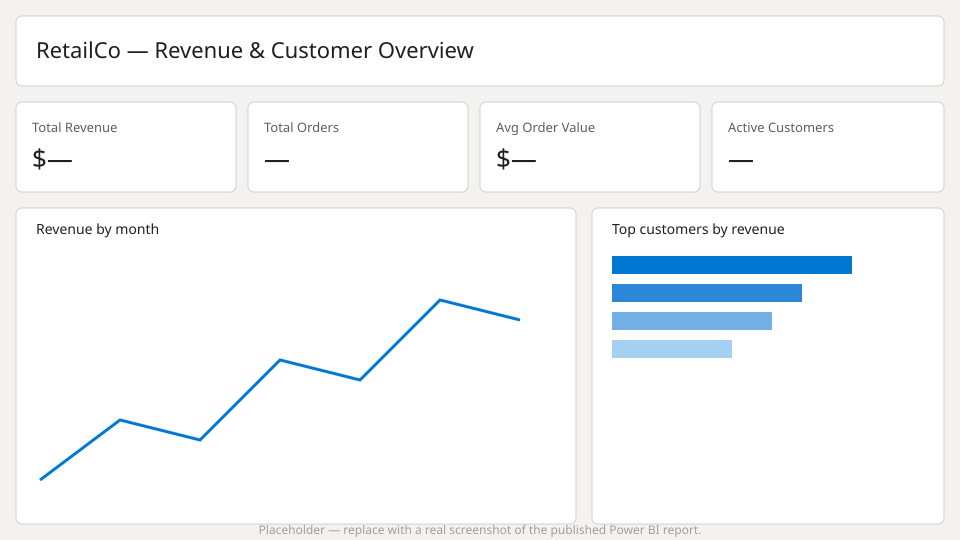

# Power BI dashboard: RetailCo — Revenue & Customer Overview



*Placeholder mockup — swap this for a real screenshot once the report is published (Power BI Desktop: File → Export → Export as image, or a screenshot of the Service page).*

## Data source

Power BI connects to the `retailco.gold` schema via the [Databricks connector](https://learn.microsoft.com/power-bi/connect-data/service-connect-power-bi-databricks) (Get Data → Databricks), pointing at the workspace's SQL warehouse HTTP path. Two tables are loaded:

- `retailco.gold.customer_address` — one row per customer
- `retailco.gold.order_summary_monthly` — one row per customer per month

**Mode**: Import, refreshed daily after the `medallion_pipeline` Workflow job completes (a Power BI scheduled refresh set ~30 minutes after the job's 03:00 UTC schedule gives it headroom to finish). DirectQuery is a reasonable alternative if near-real-time freshness matters more than dashboard responsiveness.

**Model relationship**: `customer_address[customer_id]` (one) → `order_summary_monthly[customer_id]` (many).

## Measures (DAX)

```dax
Total Revenue = SUM('order_summary_monthly'[total_amount])

Total Orders = SUM('order_summary_monthly'[total_orders])

Total Items Sold = SUM('order_summary_monthly'[total_items])

Average Order Value = DIVIDE([Total Revenue], [Total Orders])

Active Customers = DISTINCTCOUNT('order_summary_monthly'[customer_id])

Revenue per Customer = DIVIDE([Total Revenue], [Active Customers])

Revenue MoM % =
VAR CurrentMonthRevenue = [Total Revenue]
VAR PreviousMonthRevenue =
    CALCULATE(
        [Total Revenue],
        DATEADD('order_summary_monthly'[transaction_month], -1, MONTH)
    )
RETURN
    DIVIDE(CurrentMonthRevenue - PreviousMonthRevenue, PreviousMonthRevenue)
```

`transaction_month` is stored as a `yyyy-MM` string in Gold; build a proper date column in Power BI's model (`Date = DATE(LEFT([transaction_month],4), RIGHT([transaction_month],2), 1)`) so time-intelligence functions like `DATEADD` work.

## KPIs and visuals

**Top KPI cards**: Total Revenue, Total Orders, Average Order Value, Active Customers — for the currently selected month range.

**Revenue by month** (line chart): `Date` on the axis, `Total Revenue` as the value — the headline trend.

**Top customers by revenue** (bar chart): `customer_address[customer_name]` on the axis, `Total Revenue` as the value, top N filter (10).

**Revenue by billing state** (map or bar chart): `customer_address[billing_state]` on the axis/location, `Total Revenue` as the value — where the customer base is concentrated.

**Customer detail table**: `customer_name`, `email`, `Total Orders`, `Total Revenue`, `Revenue per Customer` — sortable, for drill-down from the summary visuals.

**Slicers**: month range (from the `Date` table), `billing_state`.

## Notes

- `total_amount`, `total_orders`, and `total_items` already exclude `Cancelled`/`Pending` orders (filtered in `gold_order_summary_monthly` — see [src/retailco_lakehouse/transform/gold.py](../src/retailco_lakehouse/transform/gold.py)), so no additional status filtering is needed in the report.
- Row-level security isn't configured here — this is a single-tenant internal reporting dashboard, not a customer-facing one.
